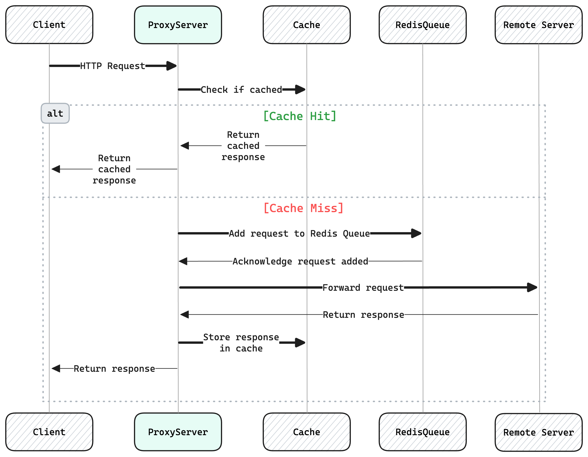

# Multi-Threaded Proxy-Server with LRU Cache and Redis-Queue

## Index

1. [Working](#working)
2. [Overview](#Project-Overview)
3. [Example](#Example)
3. [Setup and Run](#Setup-and-Run)
4. [Directory Structure](#directory-structure)


## Project Overview

1. This project implements a Multithreaded Proxy Server with Caching and Redis Queue. It designed to handle multiple HTTP **GET** requests simultaneously.
2. It features a multithreaded architecture to handle multiple incoming clients simultaneously and uses an LRU caching mechanism to minimize unnecessary requests to the remote server.
3. The project also integrates a Redis queue to manage requests during peak loads to keep things running smoothly.
4. Supports HTTP/1.x and HTTP/2.0

## Working
<!--  -->


## Example


## Setup and Run

#### Prerequisites:

* OS: macOS, Linux
* C compiler (GCC, Clang)
* CURL

#### Setup
**Clone the Repository**:

  ```bash
  git clone https://github.com/username/repository.git
  cd repository
  ```

#### Building the Project:

1. **Compile:** Open a terminal, navigate to the project directory, and run the following command:

   ```bash
   make
   ```

   This will compile the source code, link the object files, and create the proxy executable in the `bin` directory.

**Running the Proxy Server:**

2. **Default Port:** To run the proxy server on the default port (8080), execute:

   ```bash
   make run
   ```

3. **Custom Port:** To run the proxy server on a specific port (e.g., 7000), use:

   ```bash
   make run PORT=7000
   ```

**Cleaning Up:**

4. **Remove Compiled Files:** To delete all compiled files and the `build` directory, run:

   ```bash
   make clean
   ```

**Creating an Archive:**

5. **Create a Tarball:** To create a compressed archive of the project source code, Makefile, and README, execute:

   ```bash
   make tar
   ```

   This will generate a file named `ass1.tgz`.

**Important Notes:**

* The `make` command automatically determines the necessary steps based on the Makefile.
* You can customize the build process by modifying the Makefile variables (e.g., `PORT`, `CFLAGS`).
* Refer to the Makefile comments for detailed explanations of each target and variable.


## Directory Structure

    .
    ├── bin/
    ├── build/
    │
    ├── include/
    │   ├── http1.x_handler.h
    │   ├── redis_queue.h
    │   ╰── style.h
    │
    ├── src/
    │   ├── main.c
    │   ├── redis_queue.c
    │   ╰── server.c
    │
    ├── tests/
    │   ╰── test_thread_pool.c
    │
    ├── images/
    │
    ├── Todo.txt
    ├── Makefile
    ╰── README.md


### Description

- **bin/**: Directory for compiled binary files.
- **build/**: Directory for intermediate build files and object files.
- **include/**: Directory for header files.
  - **redis_queue.h**: Header file for Redis queue functions.
  - **server.h**: Header file for server-related functions.
  - **thread_pool.h**: Header file for thread pool functions.
- **src/**: Directory for source files.
  - **redis_queue.c**: Implementation of Redis queue functions.
  - **server.c**: Implementation of server functions.
  - **thread_pool.c**: Implementation of thread pool functions.
- **tests/**: Directory for test files.
  - **some_test.c**:
- **Makefile**: Makefile for building the project.
- **Todo.txt**: A list of features yet to implement.
